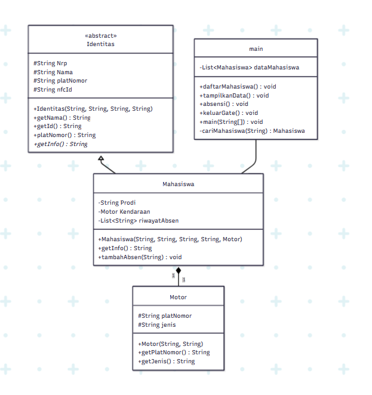

# STRUKTUR DATA OOP

<div align="center">


</div>
</div>

---

<div align="center">

|  Nama |  NRP |
|:-------:|:------:|
| **Muhammad Rafi Pramudya Putra** | `5027251024` |

</div>

##  Assignment 02

> **Description :**
> Class diagram
Kode program Java
Screenshot output
Penjelasan prinsip-prinsip OOP apa saja yang diterapkan
Penjelasan keunikan yang membedakan dengan individu lain

#### Penjelasan Algoritma : 
Disini saya akan membuat sebuah algoritma dengan penyelesaian 2 masalah utama , pertama masalah tentang absensi dan kedua tentang masalah gate system , latar belakang masalah adalah tentang banyaknya kasus pencurian di dalam lingkup `ITS`. System ini menangani bagaimana prosess gatement di `ITS`,  system gatement akan terintegrasi dengan `NFC ID` seperti `KTM`. Jadi tiap `KTM` Hanya diperbolehkan memiliki satu kendaraan saja, dan untuk keluar wajib menggunakan `KTM`. Mungkin disini code nya akan memberikan gambaran simulasi saja yang mungkin kedepanya dapat dioptimalkan lagi menggunaan program lainya seperi `opencv` dan berbagai module yang lebih efisien dalam penganganan gatement system.

#### Class Diagram :  



#### Penjelasan Code :

```java
abstract class Identitas {
    private String Nrp;
    private String Nama;
    private String platNomor;
    private String nfcId;

    public Identitas(String nrp, String nama, String id, String platNomor) {
        this.Nrp = nrp;
        this.platNomor = platNomor;
        nfcId = id;
        this.Nama = nama;
    }

    public String getNama() {
        return Nama;
    }

    public String getId() {
        return nfcId;
    }

    public String platNomor() {
        return platNomor;
    }

    public abstract String getInfo();
}
```
didalam code ini kita akan menginisiasi dulu kelas `abstract` dengan nama `Identitas`. jadi disini kita buat beberapa `private` seperti didalam code yang berguna untuk menjaga keamanan dari variabel tersebut. Constructor dari kelas ini berupa input nama,nrp,nfcId,dan plat Nomor. Lalu disini ada beberapa beberapa fungsi untuk mengembalikan nilai attribute class.

```java
class Motor {
    private String platNomor;
    private String jenis;

    public Motor(String plat, String Jenis) {
        platNomor = plat;
        jenis = Jenis;
    }

    public String getPlatNomor() {
        return platNomor;
    }

    public String getJenis() {
        return jenis;
    }
}

```
lalu di class selanjutnya ada class motor disini menampung 2 attribute private yaitu `platNomor` dan `jenis`.Didefinisikan juga beberapa methode guna mengekstrak attribute nya

```java
class Mahasiswa extends Identitas {

    private String Prodi;
    private Motor Kendaraan;
    private String nama;
    private String nrp;
    private String nfcId;

    private List<String> riwayatAbsen = new ArrayList<>();

    public Mahasiswa(String nrp, String nama, String id, String prodi, Motor motor) {
        super(nrp, nama, id, motor.getPlatNomor());
        this.Prodi = prodi;
        this.nama = nama;
        this.nrp = nrp;
        this.nfcId = id;
        Kendaraan = motor;
    }

    @Override
    public String getInfo() {
        return String.format(

                "Nama         : %s\n" +
                        "NRP          : %s\n" +
                        "Prodi        : %s\n" +
                        "NFCid        : %s\n" +
                        "Plat Motor   : %s\n" +
                        "Merk Motor   : %s\n" +
                        "Absensi      : %s\n",
                nama, nrp, Prodi, nfcId, Kendaraan.getPlatNomor(), Kendaraan.getJenis(),
                riwayatAbsen.isEmpty() ? "Belum ada" : String.join(", ", riwayatAbsen));
    }

    public void tambahAbsen(String matkul) {
        riwayatAbsen.add(matkul);
    }
}
```
untuk `class` utamanya disini ada `class` mahasiswa dengan attribute bawaan sesuai dengan format.ditambah sebuah array yang menampung riwayat kelas absesnsi yang diikuti. `Class` mahasiswa juga memiliki parent `abstract` `Identitas`.`Constructor` dari kelas ini berfungsi mengisi `Constructor` dari `Abstraksinya` menggunakn `super()` dan menginisiasi beberapa attribute nya sendiri. Methode `getInfo` berfungsi untuk menampilkan output informasi dari mahasiswa tersebut. method `tambahAbsensi` berguna menambahkan mata kuliah ke daftar list riwayat kelas.

```java
public class main {
    static List<Mahasiswa> dataMahasiswa = new ArrayList<>();

    static Mahasiswa cariMahasiswa(String id) {
        for (Mahasiswa m : dataMahasiswa) {
            if (m.getId().equalsIgnoreCase(id))
                return m;
        }
        return null;
    }

    static Scanner sc = new Scanner(System.in);

    static void daftarMahasiswa() {
        System.out.println("-------------------------------------------");
        System.out.println("PENDAFTARAN MAHASISWA");
        System.out.println("-------------------------------------------");

        System.out.print("Masukan nrp :");
        String nrp = sc.nextLine().trim();

        System.out.print("Masukan nama :");
        String nama = sc.nextLine().trim();

        System.out.print("Masukan prodi: ");
        String prodi = sc.nextLine().trim();

        System.out.print("Masukan NFC ID: ");
        String nfcId = sc.nextLine().trim();

        System.out.print("Masukan Plat Motor: ");
        String platNomor = sc.nextLine().trim();

        System.out.print("Masukan Merk Motor: ");
        String merkMotor = sc.nextLine().trim();

        Motor motor = new Motor(platNomor, merkMotor);
        dataMahasiswa.add(new Mahasiswa(nrp, nama, nfcId, prodi, motor));
        System.out.println("Data berhasil ditambahkan");
    }

    static void tampilkanData() {
        if (dataMahasiswa.isEmpty()) {
            System.out.println("Data masih kosong");
            return;
        }
        for (Mahasiswa m : dataMahasiswa) {
            System.out.println(m.getInfo());
        }
    }

    static void absensi() {
        System.out.print("Masukan NFC ID: ");
        String nfcId = sc.nextLine().trim();
        System.out.print("Masukan Matkul: ");
        String matkul = sc.nextLine().trim();

        Mahasiswa mahasiswa = cariMahasiswa(nfcId);
        if (mahasiswa == null) {
            System.out.println("Data tidak ditemukana");
            return;

        }
        mahasiswa.tambahAbsen(matkul);

        System.out.println("berhasil absen di matkul " + matkul);
    }

    static void keluarGate() {
        System.out.print("Masukan NFC ID: ");
        String nfcId = sc.nextLine().trim();
        System.out.print("Masukan Plat Nomor: ");
        String platNomor = sc.nextLine().trim();

        Mahasiswa mahasiswa = cariMahasiswa(nfcId);
        if (mahasiswa == null) {
            System.out.println("Credential Palsu kamu pencuri ya...");
        }
        if (mahasiswa.platNomor().equalsIgnoreCase(platNomor)) {
            System.out.println("Berhasil Keluar Palang ke buka");
        } else {
            System.out.println("Credential Palsu kamu pencuri ya...");
        }
    }

    public static void main(String[] args) {
        System.out.println();
        System.out.println("  ====================================================");
        System.out.println("    SISTEM INFORMASI MAHASISWA — PARKIR & ABSENSI");
        System.out.println("  ====================================================");

        while (true) {
            System.out.println();
            System.out.println("  MENU UTAMA");
            System.out.println("  ====================================================");
            System.out.println("  1. Daftar Mahasiswa & Motor");
            System.out.println("  2. Tampilkan Semua Data");
            System.out.println("  3. Absensi");
            System.out.println("  4. Keluar Gate Parkir  (NFC + Plat Nomor)");
            System.out.println("  0. Exit");
            System.out.println("  ====================================================");
            System.out.print("Masukan pilihan: ");
            String pilihan = sc.nextLine().trim();
            switch (pilihan) {
                case "1":
                    daftarMahasiswa();
                    break;
                case "2":
                    tampilkanData();
                    break;
                case "3":
                    absensi();
                    break;
                case "4":
                    keluarGate();
                    break;
                case "0":
                    System.out.println("  Sampai jumpa!");
                    sc.close();
                    return;
                default:
                    System.out.println("  [!] Pilihan tidak valid.");
            }
        }

    }
}
```
ini adalah constructor utama dari file `main.java`. class main memilki class tambahan sebagai validator cek data yang berguna mengecek adakah id yang sesuai didalam array dataMahasiswa. selain itu class main memiliki 4 methode utama. Pertama methode buat menambah data dengan cara memasukan inut sesuai format lalu menambahkan ke class mahasiswa dengan membuat object baru dan menyimpanya ke dalam array mahasiswa.method kedua berguna untuk menampilkan data seluruh mahasiswa yang terdaftar dengan memanggil methode `getInfo()` tiap object didalam array. Methode ketiga berguna absensi mahasiswa dengan cara memastikan apakah mahasiswa valid, lalu jika valid memasukan kelas yang diikuti ke dalam array riwayatKelas milik object mahasiswa yang dituju.fungsi keempat berfungsi sebagai gatement validation dengan cara memasukan 2 input berupa `nfcId` dan plat nomor. jika data tersedia sesua `nfcId` dan plat nomornya sesuai dari object yang dituju maka grbang akan terbuka.

agar lebih interaktif disini ada terminal interaksi `whileLoop` dengan 4 pilihan sesuai 4 fungsi yang sudah dideklarasikan

#### Penjelasan Prinsip OOP:

##### Abstraction:
mendeklarasikan abstraction dengan nama `Identitas` yang berguna sebagai template dasar dari sebuah format yang nantinya akan digunakan kedalam class Mahasiswa.
```java
abstract class Identitas {
    ...
}
```

##### Encasulaption
mendeklarasikan data dengan value `private` yang berguna untuk melindungi data agar hanya digunakan didalam class tersebut
```java
    private String Nrp;
    private String Nama;
    private String platNomor;
    private String nfcId;
```
##### Inheritance
disini class mahasiswa meng extends dari `abstraction` Identitas yang menandakan pewarisan
```java
class Mahasiswa extends Identitas {
}
```
#### Polymorphism
di dalam class Mahasiswa meng `ovveride` sebuah methode `getInfo()` yang menandakan sebuah pergantian perilaku methode antar class
```java
    @Override
    public String getInfo() {
        ....
    }
```
#### Contoh Output :
```bash

  MENU UTAMA
  ====================================================
  1. Daftar Mahasiswa & Motor
  2. Tampilkan Semua Data
  3. Absensi
  4. Keluar Gate Parkir  (NFC + Plat Nomor)
  0. Exit
  ====================================================
Masukan pilihan: 1
-------------------------------------------
PENDAFTARAN MAHASISWA
-------------------------------------------
Masukan nrp :024
Masukan nama :rafi
Masukan prodi: ti
Masukan NFC ID: 0812333
Masukan Plat Motor: S 333 LA
Masukan Merk Motor: Honda
Data berhasil ditambahkan

  MENU UTAMA
  ====================================================
  1. Daftar Mahasiswa & Motor
  2. Tampilkan Semua Data
  3. Absensi
  4. Keluar Gate Parkir  (NFC + Plat Nomor)
  0. Exit
  ====================================================
Masukan pilihan: 4
Masukan NFC ID: 0812333
Masukan Plat Nomor: S 333 LA
Berhasil Keluar Palang ke buka
```
#### Penjelasan Keunikan : 
jujur ini pertanyaan yang cukup sulit karena saya tidak mengetahui code teman saya 🙃, jadi mungkin keunikan dari code saya adalah sebuah prosess interaktif yang menjadikan code ini seperti sebuah applikasi

---
<div align="center">

**STRUKDAT 2 · 2026 · IT-024**

</div>

